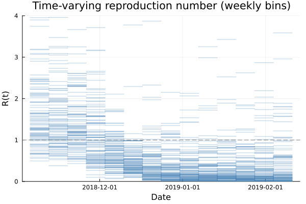

# Andes virus — joint estimation of incubation, transmission timing, and R(t)

A Julia + Turing model fitted to the Epuyén 2018–19 Andes hantavirus outbreak
([Martínez et al. 2020, NEJM](https://doi.org/10.1056/NEJMoa2009040)).

The model estimates four things from the line list in the paper: the
incubation period, the transmission timing of each secondary infection
relative to its source's symptom onset, a weekly time-varying reproduction
number, and offspring dispersion. Exposure and onset dates are
interval-censored. The model handles that by giving each case a continuous
latent infection time and a continuous latent onset time, each sampled
within its recorded window. Generation interval and serial interval are
derived from the fitted distributions in post-processing.

## Headline results (Epuyén line list)

### Incubation period (LogNormal)

| Quantity | Posterior median (95% CrI) |
|---|---|
| Mean | 22.6 d (20.2 – 25.5) |
| 95th percentile | 36.2 d (31.3 – 44.5) |
| 99th percentile | 45.0 d (37.6 – 58.7) |

### Transmission timing relative to source onset (Normal)

Negative values mean the secondary was infected before the source became symptomatic.

| Quantity | Posterior median (95% CrI) |
|---|---|
| Mean | 0.2 d (−0.2 – 0.5) |
| SD | 0.6 d (0.5 – 0.8) |
| P(pre-symptomatic by more than 1 day) | 0.03 (0.00 – 0.12) |
| P(pre-symptomatic by more than 2 days) | 0.00 (0.00 – 0.01) |

### Generation interval / serial interval

Both are the transmission timing plus an incubation period (the source's
for GI, the secondary's for SI), and share the same marginal distribution.

| Quantity | Posterior median (95% CrI) |
|---|---|
| Mean | 22.7 d (20.4 – 25.6) |
| SD | 7.4 d (5.7 – 10.6) |

### Offspring count (Negative-Binomial)

Per case the mean is `R(t)` evaluated at the case's infection time, and `k` is the dispersion.

| Quantity | Posterior median (95% CrI) |
|---|---|
| Dispersion `k` | 0.4 (0.1 – 0.9) |

### Time-varying reproduction number R(t)

Weekly bins; shaded band is the 95% credible interval.



## Methods

Each case has two continuous latents. `T_onset[i]` is uniform over the
recorded onset window, which is one day wide if only a single onset date
was recorded. `T_inf[i]` is uniform over the exposure window for sourced
cases, or over an 80-day pre-onset window for the zoonotic index.

| Quantity | Distribution | Priors |
|---|---|---|
| Incubation period (`T_onset − T_inf`) | LogNormal | log-mean ~ Normal(3.0, 0.5), log-SD ~ half-Normal(0, 0.5) |
| Transmission timing relative to source onset (`T_inf(sec) − T_onset(src)`) | Normal | mean ~ Normal(0, 5), SD ~ half-Normal(0, 1) |
| Offspring count `Z` per case | Negative-Binomial with mean `R(t)` and dispersion `k` | `k` ~ half-Normal(0.3, 0.5) |
| `log R(t)` over weekly bins | Random walk | first bin ~ Normal(log 1.5, 1); innovation SD ~ half-Normal(0, 0.5) |

A per-pair constraint enforces `T_inf(secondary) > T_inf(source)` so that
the generation interval is positive. Generation interval = transmission
timing + source's incubation period; serial interval = transmission timing
+ secondary's incubation period. Both are computed in post-processing.

Inference uses NUTS, 4 chains, 1000 post-warmup samples each, `target_accept = 0.95`. Default seed: 20260508.

## Limitations

Most of what the model can say about transmission timing is limited by how
the line list was recorded. 31 of 33 sourced pairs have a single-day
exposure window, and that day is almost always the source's symptom onset.
The fitted transmission-timing SD of about 0.6 d mostly reflects within-day
uncertainty in `T_inf` rather than biological spread; we cannot disentangle
the two from these data. Multi-day pre-symptomatic transmission is therefore
robustly rare in this outbreak (P(δ < −1 d) ≈ 3%, P(δ < −2 d) essentially
zero), but the headline split into "any pre-symptomatic" vs "post-symptomatic"
would be dominated by this within-day floor and is not reported.

There are very few cases after early January 2019, and the random walk on
`log R(t)` reverts to its prior in those bins. The wide credible intervals
on the right of the figure show this.

34 cases is thin for identifying a Negative-Binomial dispersion. The prior
on `k`, centred at 0.3, has visible influence on the posterior centre.

## Repository layout

```
src/
  Hantavirus.jl    — module entry point and imports
  data.jl          — line list loading and bin definitions
  model.jl         — the joint Turing model (incubation, transmission timing, R(t))
  postprocess.jl   — diagnostics, summaries, CSV output, R(t) figure
  main.jl          — CLI entry point (argument parsing)
data/
  linelist.csv     — Epuyén outbreak line list (Martínez Table S2)
output/
  figures/         — generated figures (Rt.png, delta_sense_check.png)
Project.toml       — Julia package manifest
Manifest.toml      — locked dependency versions
LICENSE            — MIT
```

## Data

`data/linelist.csv` is hand-encoded from Table S2 of the supplementary
appendix of Martínez et al. 2020. Columns: patient ID, age, sex, residence,
exposure place, exposure window (lower / upper), onset date, attributed
source (or `index` for the zoonotic case), relationship to source,
transmission wave, observed offspring count `Z`, and free-text notes.

## Running

```
julia --project=. -t auto -m Hantavirus
```

A few minutes on a laptop. Posterior saved to `output/posterior.csv` and
figures to `output/figures/`.

Options:

```
-d, --data      path to linelist CSV   (default: data/linelist.csv)
-o, --output    output directory        (default: output/)
-n, --samples   NUTS samples per chain  (default: 1000)
-c, --chains    number of chains        (default: 4)
-s, --seed      random seed             (default: 20260508)
```

Example:

```
julia --project=. -t auto -m Hantavirus -- -n 500 -c 2 -o results/
```

### From the REPL

```julia
julia> using Hantavirus
julia> analyse()                                           # all defaults
julia> analyse(chains=2, samples=500, output="results/")  # with options
```

## Citing

If you use this code or the line list encoding, please cite:

> Martínez VP, Di Paola N, Alonso DO, et al. *"Super-spreaders" and
> person-to-person transmission of Andes virus in Argentina.* N Engl J Med
> 2020;383:2230–41. [doi:10.1056/NEJMoa2009040](https://doi.org/10.1056/NEJMoa2009040)

The reporting follows the recommendations of:

> Charniga K, et al. *Best practices for estimating and reporting
> epidemiological delay distributions of infectious diseases.* 2024.
> [arXiv:2405.08841](https://arxiv.org/abs/2405.08841)

## License

MIT (see [LICENSE](LICENSE)).
