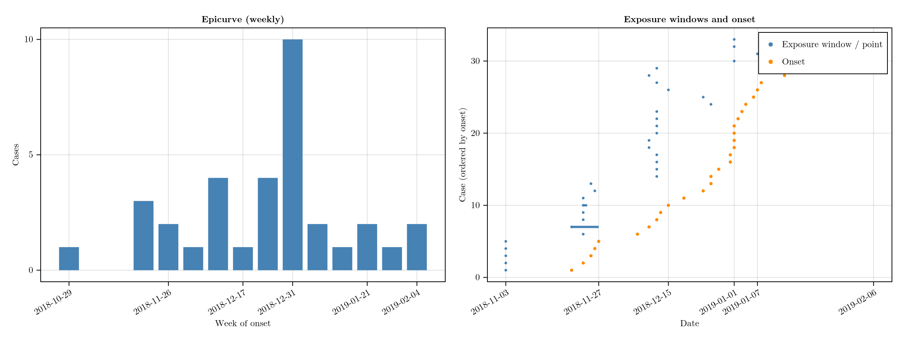
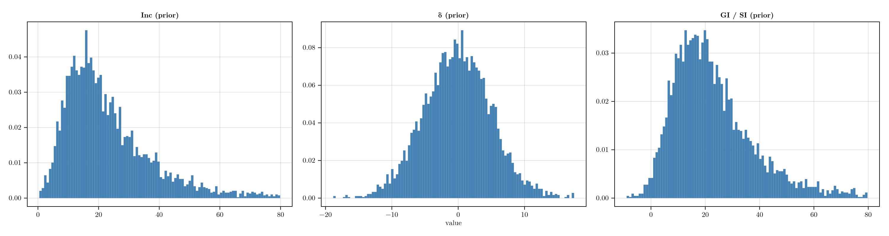
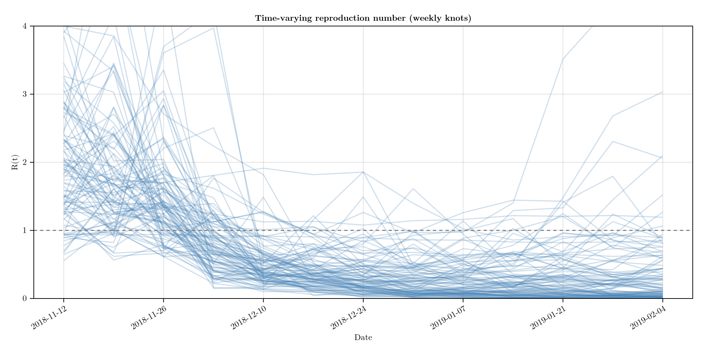
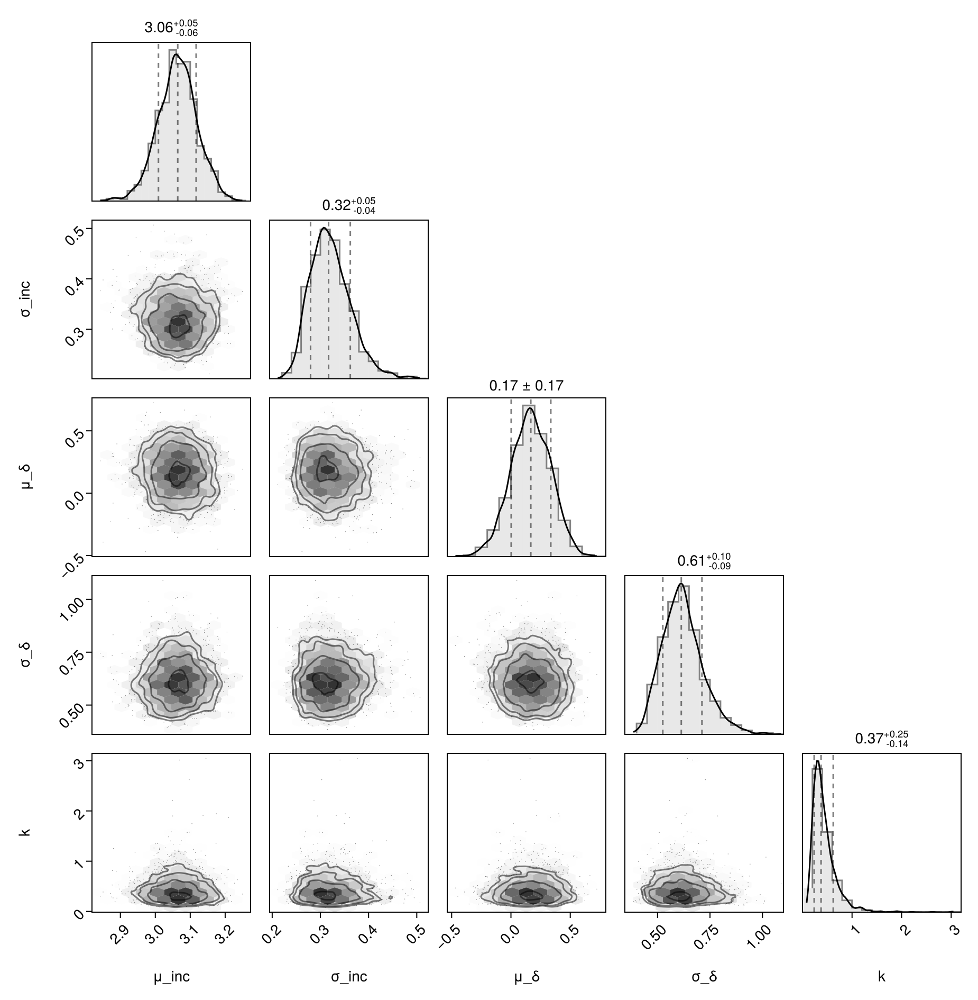
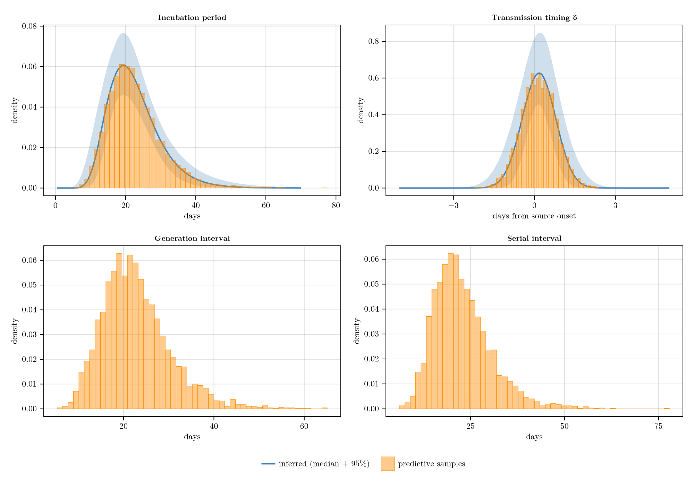
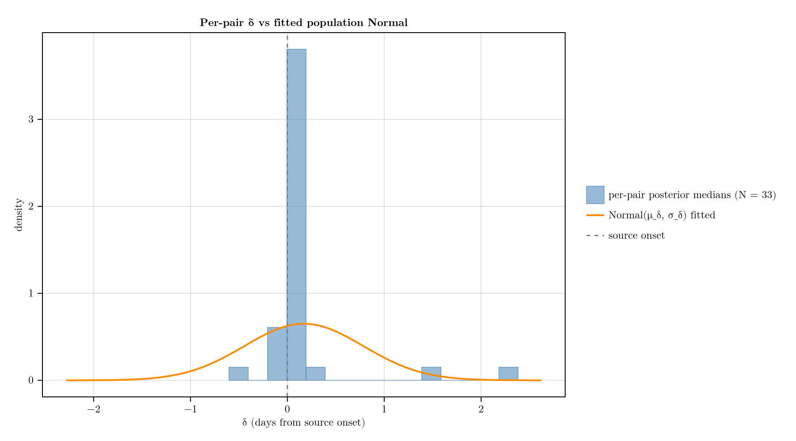
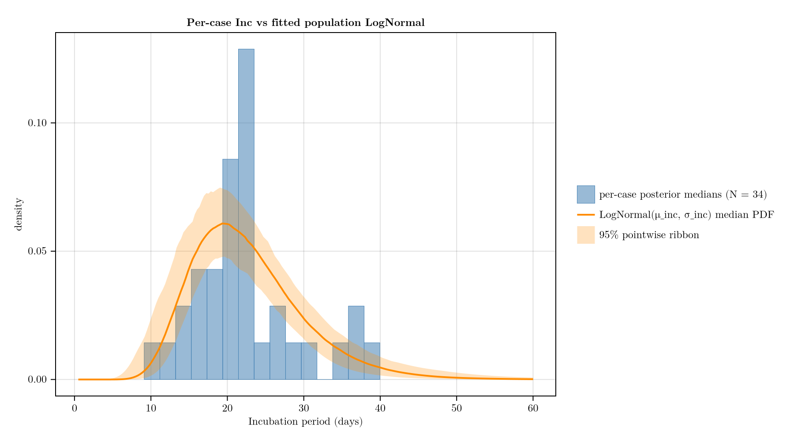
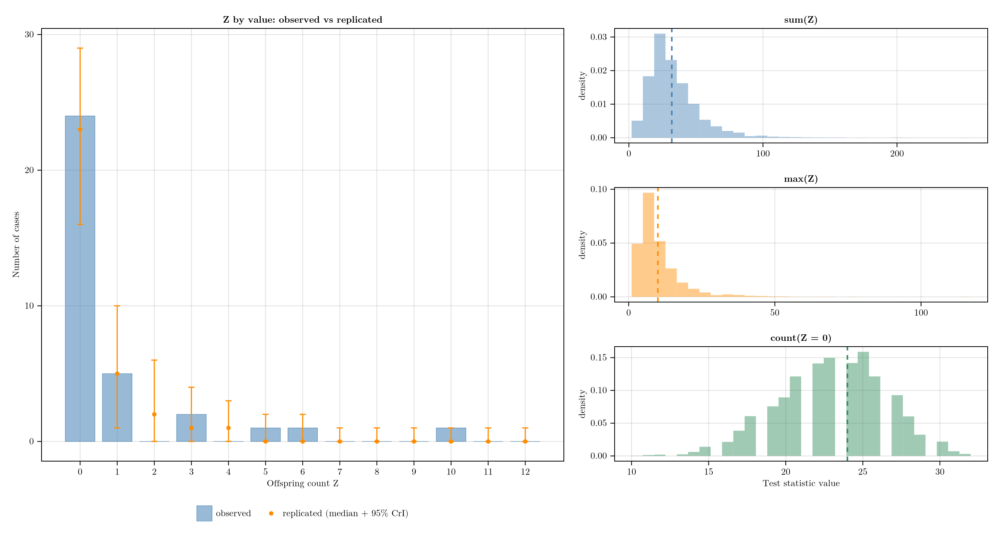

# Analysis walkthrough {#Analysis-walkthrough}

The Epuyén 2018–19 outbreak in north-west Patagonia was the first cluster where person-to-person Andes hantavirus transmission was documented at scale. The line list bundled with this package is hand-encoded from Table S2 of [Martínez et al. 2020](https://doi.org/10.1056/NEJMoa2009040) — 34 cases with exposure windows, symptom-onset dates, and attributed source cases.

This page fits the joint model in `TransmissionLinelist.jl` to that line list and renders the headline outputs. Four quantities are estimated together: the incubation period, the transmission timing of each secondary relative to its source&#39;s symptom onset (δ), a weekly time-varying reproduction number R(t), and the offspring dispersion `k` of a Negative-Binomial. Exposure and onset dates are interval-censored. The model handles that by giving each case a continuous latent infection time and a continuous latent onset time, each sampled within its recorded window. Generation interval and serial interval are derived in post-processing as the transmission timing plus an incubation period (the source&#39;s for GI, the secondary&#39;s for SI). Fitting all four jointly propagates uncertainty between them that a delay-then-R(t) pipeline would lose.

Priors, the data-augmentation construction, and per-pair GI &gt; 0 constraint are detailed on the [Model](model.md) page. Caveats around exposure encoding, late R(t) bins, and right-truncation are on the [Limitations](limitations.md) page.

```julia
using TransmissionLinelist
using Chain
using DataFrames
using DataFramesMeta
using FlexiChains
using Printf
using Random
using CairoMakie
using AlgebraOfGraphics
using PairPlots

Random.seed!(20260508)
```


```ansi
Random.TaskLocalRNG()
```


## Load the line list {#Load-the-line-list}

`load_linelist` parses the bundled CSV and drops the `_alt` sensitivity rows. `build_data` re-encodes exposure / onset windows as day offsets from `t0` (60 days before the first onset); `bin_edges_day` returns the weekly R(t) knot dates as day offsets.

```julia
ll    = load_linelist()
d     = build_data(ll)
edges = bin_edges_day(d.t0)
model = joint_model(d, edges)

@chain ll begin
    @select(:patient_id, :exposure_lower, :exposure_upper,
            :onset_date, :source_case, :Z)
    first(8)
end
```

<div v-html="`&lt;div&gt;&lt;div style = &quot;float: left;&quot;&gt;&lt;span&gt;8×6 DataFrame&lt;/span&gt;&lt;/div&gt;&lt;div style = &quot;clear: both;&quot;&gt;&lt;/div&gt;&lt;/div&gt;&lt;div class = &quot;data-frame&quot; style = &quot;overflow-x: scroll;&quot;&gt;&lt;table class = &quot;data-frame&quot; style = &quot;margin-bottom: 6px;&quot;&gt;&lt;thead&gt;&lt;tr class = &quot;columnLabelRow&quot;&gt;&lt;th class = &quot;stubheadLabel&quot; style = &quot;font-weight: bold; text-align: right;&quot;&gt;Row&lt;/th&gt;&lt;th style = &quot;text-align: left;&quot;&gt;patient_id&lt;/th&gt;&lt;th style = &quot;text-align: left;&quot;&gt;exposure_lower&lt;/th&gt;&lt;th style = &quot;text-align: left;&quot;&gt;exposure_upper&lt;/th&gt;&lt;th style = &quot;text-align: left;&quot;&gt;onset_date&lt;/th&gt;&lt;th style = &quot;text-align: left;&quot;&gt;source_case&lt;/th&gt;&lt;th style = &quot;text-align: left;&quot;&gt;Z&lt;/th&gt;&lt;/tr&gt;&lt;tr class = &quot;columnLabelRow&quot;&gt;&lt;th class = &quot;stubheadLabel&quot; style = &quot;font-weight: bold; text-align: right;&quot;&gt;&lt;/th&gt;&lt;th title = &quot;String&quot; style = &quot;text-align: left;&quot;&gt;String&lt;/th&gt;&lt;th title = &quot;Union{Missing, Dates.Date}&quot; style = &quot;text-align: left;&quot;&gt;Date?&lt;/th&gt;&lt;th title = &quot;Union{Missing, Dates.Date}&quot; style = &quot;text-align: left;&quot;&gt;Date?&lt;/th&gt;&lt;th title = &quot;Dates.Date&quot; style = &quot;text-align: left;&quot;&gt;Date&lt;/th&gt;&lt;th title = &quot;Union{Missing, InlineStrings.String15}&quot; style = &quot;text-align: left;&quot;&gt;String15?&lt;/th&gt;&lt;th title = &quot;Int64&quot; style = &quot;text-align: left;&quot;&gt;Int64&lt;/th&gt;&lt;/tr&gt;&lt;/thead&gt;&lt;tbody&gt;&lt;tr class = &quot;dataRow&quot;&gt;&lt;td class = &quot;rowLabel&quot; style = &quot;font-weight: bold; text-align: right;&quot;&gt;1&lt;/td&gt;&lt;td style = &quot;text-align: left;&quot;&gt;1&lt;/td&gt;&lt;td style = &quot;font-style: italic; text-align: left;&quot;&gt;missing&lt;/td&gt;&lt;td style = &quot;font-style: italic; text-align: left;&quot;&gt;missing&lt;/td&gt;&lt;td style = &quot;text-align: left;&quot;&gt;2018-11-03&lt;/td&gt;&lt;td style = &quot;font-style: italic; text-align: left;&quot;&gt;missing&lt;/td&gt;&lt;td style = &quot;text-align: right;&quot;&gt;5&lt;/td&gt;&lt;/tr&gt;&lt;tr class = &quot;dataRow&quot;&gt;&lt;td class = &quot;rowLabel&quot; style = &quot;font-weight: bold; text-align: right;&quot;&gt;2&lt;/td&gt;&lt;td style = &quot;text-align: left;&quot;&gt;2&lt;/td&gt;&lt;td style = &quot;text-align: left;&quot;&gt;2018-11-03&lt;/td&gt;&lt;td style = &quot;text-align: left;&quot;&gt;2018-11-03&lt;/td&gt;&lt;td style = &quot;text-align: left;&quot;&gt;2018-11-23&lt;/td&gt;&lt;td style = &quot;text-align: left;&quot;&gt;1&lt;/td&gt;&lt;td style = &quot;text-align: right;&quot;&gt;6&lt;/td&gt;&lt;/tr&gt;&lt;tr class = &quot;dataRow&quot;&gt;&lt;td class = &quot;rowLabel&quot; style = &quot;font-weight: bold; text-align: right;&quot;&gt;3&lt;/td&gt;&lt;td style = &quot;text-align: left;&quot;&gt;3&lt;/td&gt;&lt;td style = &quot;text-align: left;&quot;&gt;2018-11-03&lt;/td&gt;&lt;td style = &quot;text-align: left;&quot;&gt;2018-11-03&lt;/td&gt;&lt;td style = &quot;text-align: left;&quot;&gt;2018-11-20&lt;/td&gt;&lt;td style = &quot;text-align: left;&quot;&gt;1&lt;/td&gt;&lt;td style = &quot;text-align: right;&quot;&gt;0&lt;/td&gt;&lt;/tr&gt;&lt;tr class = &quot;dataRow&quot;&gt;&lt;td class = &quot;rowLabel&quot; style = &quot;font-weight: bold; text-align: right;&quot;&gt;4&lt;/td&gt;&lt;td style = &quot;text-align: left;&quot;&gt;4&lt;/td&gt;&lt;td style = &quot;text-align: left;&quot;&gt;2018-11-03&lt;/td&gt;&lt;td style = &quot;text-align: left;&quot;&gt;2018-11-03&lt;/td&gt;&lt;td style = &quot;text-align: left;&quot;&gt;2018-11-27&lt;/td&gt;&lt;td style = &quot;text-align: left;&quot;&gt;1&lt;/td&gt;&lt;td style = &quot;text-align: right;&quot;&gt;0&lt;/td&gt;&lt;/tr&gt;&lt;tr class = &quot;dataRow&quot;&gt;&lt;td class = &quot;rowLabel&quot; style = &quot;font-weight: bold; text-align: right;&quot;&gt;5&lt;/td&gt;&lt;td style = &quot;text-align: left;&quot;&gt;5&lt;/td&gt;&lt;td style = &quot;text-align: left;&quot;&gt;2018-11-03&lt;/td&gt;&lt;td style = &quot;text-align: left;&quot;&gt;2018-11-03&lt;/td&gt;&lt;td style = &quot;text-align: left;&quot;&gt;2018-11-26&lt;/td&gt;&lt;td style = &quot;text-align: left;&quot;&gt;1&lt;/td&gt;&lt;td style = &quot;text-align: right;&quot;&gt;1&lt;/td&gt;&lt;/tr&gt;&lt;tr class = &quot;dataRow&quot;&gt;&lt;td class = &quot;rowLabel&quot; style = &quot;font-weight: bold; text-align: right;&quot;&gt;6&lt;/td&gt;&lt;td style = &quot;text-align: left;&quot;&gt;6&lt;/td&gt;&lt;td style = &quot;text-align: left;&quot;&gt;2018-11-03&lt;/td&gt;&lt;td style = &quot;text-align: left;&quot;&gt;2018-11-03&lt;/td&gt;&lt;td style = &quot;text-align: left;&quot;&gt;2018-11-25&lt;/td&gt;&lt;td style = &quot;text-align: left;&quot;&gt;1&lt;/td&gt;&lt;td style = &quot;text-align: right;&quot;&gt;0&lt;/td&gt;&lt;/tr&gt;&lt;tr class = &quot;dataRow&quot;&gt;&lt;td class = &quot;rowLabel&quot; style = &quot;font-weight: bold; text-align: right;&quot;&gt;7&lt;/td&gt;&lt;td style = &quot;text-align: left;&quot;&gt;7&lt;/td&gt;&lt;td style = &quot;text-align: left;&quot;&gt;2018-11-23&lt;/td&gt;&lt;td style = &quot;text-align: left;&quot;&gt;2018-11-23&lt;/td&gt;&lt;td style = &quot;text-align: left;&quot;&gt;2018-12-07&lt;/td&gt;&lt;td style = &quot;text-align: left;&quot;&gt;2&lt;/td&gt;&lt;td style = &quot;text-align: right;&quot;&gt;0&lt;/td&gt;&lt;/tr&gt;&lt;tr class = &quot;dataRow&quot;&gt;&lt;td class = &quot;rowLabel&quot; style = &quot;font-weight: bold; text-align: right;&quot;&gt;8&lt;/td&gt;&lt;td style = &quot;text-align: left;&quot;&gt;8&lt;/td&gt;&lt;td style = &quot;text-align: left;&quot;&gt;2018-11-23&lt;/td&gt;&lt;td style = &quot;text-align: left;&quot;&gt;2018-11-23&lt;/td&gt;&lt;td style = &quot;text-align: left;&quot;&gt;2018-12-13&lt;/td&gt;&lt;td style = &quot;text-align: left;&quot;&gt;2&lt;/td&gt;&lt;td style = &quot;text-align: right;&quot;&gt;1&lt;/td&gt;&lt;/tr&gt;&lt;/tbody&gt;&lt;/table&gt;&lt;/div&gt;`"></div>

## What the data looks like {#What-the-data-looks-like}

```julia
plot_data(ll)
```

{width=1200px height=450px}

## Model {#Model}

```julia
@model function joint_model(d, edges)
    # Population-level parameters
    μ_inc ~ Normal(3.0, 0.5)                       # log-mean Inc (≈ log 20 d)
    σ_inc ~ truncated(Normal(0.0, 0.5); lower = 0) # log-SD Inc
    μ_δ   ~ Normal(0.0, 5.0)                       # population mean transmission timing (d from source onset)
    σ_δ   ~ truncated(Normal(0.0, 1.0); lower = 0) # population SD of transmission timing (d)
    # NB offspring dispersion via Stan's reciprocal-sqrt reparameterisation:
    # 1/√k is the SD multiplier in Var = μ + μ²·(1/√k)². Half-Normal(0, 1)
    # spans Poisson (1/√k → 0) to heavy super-spreader (1/√k ≈ 2)
    # symmetrically on the overdispersion scale.
    phi_inv_sqrt ~ truncated(Normal(0.0, 1.0); lower = 0)
    k := 1.0 / phi_inv_sqrt^2
    σ_rw  ~ truncated(Normal(0.0, 0.5); lower = 0) # log-R RW innovation SD allows sharp R(t) swings under interventions

    # Concrete element type derived from a sampled scalar — avoids the
    # dynamic-dispatch tax that `Vector{Real}` imposes on AD backends.
    T = typeof(μ_inc)

    # Non-centred random walk on log R(t) at the weekly knots. log_R[b] is
    # the value at knot b; R(t) is linearly interpolated between knots.
    n_knots = length(edges)
    log_R_init ~ Normal(log(1.5), 1.0)
    ε ~ Turing.filldist(Normal(zero(T), one(T)), n_knots - 1)
    log_R := vcat(log_R_init, log_R_init .+ accumulate(+, σ_rw .* ε))

    inc_dist = LogNormal(μ_inc, σ_inc)

    # T_onset is a latent over the recorded onset window (defaults to a
    # one-day window when only a single onset date was recorded).
    T_onset = Vector{T}(undef, d.N)
    for i in 1:d.N
        T_onset[i] ~ Uniform(d.onset_lo_day[i], d.onset_hi_day[i])
    end

    T_inf = Vector{T}(undef, d.N)
    for i in 1:d.N
        if d.source_idx[i] == 0
            # Zoonotic index: free latent T_inf pre-onset.
            T_inf[i] ~ Uniform(d.onset_lo_day[i] - 80.0, T_onset[i] - 1e-6)
            inc_i = T_onset[i] - T_inf[i]
            Turing.@addlogprob! logpdf(inc_dist, inc_i)
        else
            # Sourced case: T_inf anchored to listed exposure window.
            # GI > 0 enforced by rejecting trajectories where the secondary
            # was infected before its source.
            src = d.source_idx[i]
            T_inf[i] ~ Uniform(d.exp_lo_day[i], d.exp_hi_day[i])
            if T_inf[i] <= T_inf[src]
                Turing.@addlogprob! -Inf
            else
                inc_i  = T_onset[i] - T_inf[i]
                δ_pair = T_inf[i] - T_onset[src]
                Turing.@addlogprob! logpdf(inc_dist, inc_i)
                Turing.@addlogprob! logpdf(Normal(μ_δ, σ_δ), δ_pair)
            end
        end
        R_i = exp(log_R_at(T_inf[i], edges, log_R))
        d.Zobs[i] ~ NegativeBinomial(k, k / (k + R_i))
    end
end
```


## Prior predictives {#Prior-predictives}

Implied prior distributions for the incubation period, transmission timing δ, and the derived generation / serial interval before any data are seen.

```julia
plot_prior_predictives()
```

{width=1500px height=400px}

## Fitting {#Fitting}

`sample_fit` wraps the package&#39;s default NUTS configuration: Enzyme reverse-mode AD, chains initialised from the prior, 1000 post-warmup draws across 4 chains, `target_accept = 0.95`.

```julia
chn = sample_fit(model)
```


```ansi
╭─FlexiChain (1000 iterations, 4 chains) ──────────────────────────────────────╮
│ ↓ iter  = 501:1500                                                           │
│ → chain = 1:4                                                                │
│                                                                              │
│ Parameters (12) ── AbstractPPL.VarName                                       │
│  Float64          μ_inc, σ_inc, μ_δ, σ_δ, phi_inv_sqrt, k, σ_rw, log_R_init  │
│  Vector{Float64}  ε, log_R, T_onset, T_inf                                   │
│                                                                              │
│ Extras (14)                                                                  │
│  Int64    n_steps, tree_depth                                                │
│  Bool     is_accept, numerical_error                                         │
│  Float64  acceptance_rate, log_density, hamiltonian_energy,                  │
│           hamiltonian_energy_error, max_hamiltonian_energy_error, step_size, │
│           nom_step_size, logprior, loglikelihood, logjoint                   │
╰──────────────────────────────────────────────────────────────────────────────╯
```


## Diagnostics {#Diagnostics}

Maximum R̂, minimum bulk ESS, divergence count, and wall-clock sampling time (seconds, approximated by the slowest chain under `MCMCThreads`).

```julia
diagnostics_table(chn)
```

<div v-html="`&lt;div&gt;&lt;div style = &quot;float: left;&quot;&gt;&lt;span&gt;1×4 DataFrame&lt;/span&gt;&lt;/div&gt;&lt;div style = &quot;clear: both;&quot;&gt;&lt;/div&gt;&lt;/div&gt;&lt;div class = &quot;data-frame&quot; style = &quot;overflow-x: scroll;&quot;&gt;&lt;table class = &quot;data-frame&quot; style = &quot;margin-bottom: 6px;&quot;&gt;&lt;thead&gt;&lt;tr class = &quot;columnLabelRow&quot;&gt;&lt;th class = &quot;stubheadLabel&quot; style = &quot;font-weight: bold; text-align: right;&quot;&gt;Row&lt;/th&gt;&lt;th style = &quot;text-align: left;&quot;&gt;rhat_max&lt;/th&gt;&lt;th style = &quot;text-align: left;&quot;&gt;ess_min&lt;/th&gt;&lt;th style = &quot;text-align: left;&quot;&gt;divergences&lt;/th&gt;&lt;th style = &quot;text-align: left;&quot;&gt;runtime_seconds&lt;/th&gt;&lt;/tr&gt;&lt;tr class = &quot;columnLabelRow&quot;&gt;&lt;th class = &quot;stubheadLabel&quot; style = &quot;font-weight: bold; text-align: right;&quot;&gt;&lt;/th&gt;&lt;th title = &quot;Float64&quot; style = &quot;text-align: left;&quot;&gt;Float64&lt;/th&gt;&lt;th title = &quot;Float64&quot; style = &quot;text-align: left;&quot;&gt;Float64&lt;/th&gt;&lt;th title = &quot;Int64&quot; style = &quot;text-align: left;&quot;&gt;Int64&lt;/th&gt;&lt;th title = &quot;Float64&quot; style = &quot;text-align: left;&quot;&gt;Float64&lt;/th&gt;&lt;/tr&gt;&lt;/thead&gt;&lt;tbody&gt;&lt;tr class = &quot;dataRow&quot;&gt;&lt;td class = &quot;rowLabel&quot; style = &quot;font-weight: bold; text-align: right;&quot;&gt;1&lt;/td&gt;&lt;td style = &quot;text-align: right;&quot;&gt;1.00464&lt;/td&gt;&lt;td style = &quot;text-align: right;&quot;&gt;2371.79&lt;/td&gt;&lt;td style = &quot;text-align: right;&quot;&gt;0&lt;/td&gt;&lt;td style = &quot;text-align: right;&quot;&gt;64.6392&lt;/td&gt;&lt;/tr&gt;&lt;/tbody&gt;&lt;/table&gt;&lt;/div&gt;`"></div>

## Key outputs {#Key-outputs}

```julia
summary_table(chn)
```

<div v-html="`&lt;div&gt;&lt;div style = &quot;float: left;&quot;&gt;&lt;span&gt;8×4 DataFrame&lt;/span&gt;&lt;/div&gt;&lt;div style = &quot;clear: both;&quot;&gt;&lt;/div&gt;&lt;/div&gt;&lt;div class = &quot;data-frame&quot; style = &quot;overflow-x: scroll;&quot;&gt;&lt;table class = &quot;data-frame&quot; style = &quot;margin-bottom: 6px;&quot;&gt;&lt;thead&gt;&lt;tr class = &quot;columnLabelRow&quot;&gt;&lt;th class = &quot;stubheadLabel&quot; style = &quot;font-weight: bold; text-align: right;&quot;&gt;Row&lt;/th&gt;&lt;th style = &quot;text-align: left;&quot;&gt;quantity&lt;/th&gt;&lt;th style = &quot;text-align: left;&quot;&gt;median&lt;/th&gt;&lt;th style = &quot;text-align: left;&quot;&gt;lower_95&lt;/th&gt;&lt;th style = &quot;text-align: left;&quot;&gt;upper_95&lt;/th&gt;&lt;/tr&gt;&lt;tr class = &quot;columnLabelRow&quot;&gt;&lt;th class = &quot;stubheadLabel&quot; style = &quot;font-weight: bold; text-align: right;&quot;&gt;&lt;/th&gt;&lt;th title = &quot;String&quot; style = &quot;text-align: left;&quot;&gt;String&lt;/th&gt;&lt;th title = &quot;Float64&quot; style = &quot;text-align: left;&quot;&gt;Float64&lt;/th&gt;&lt;th title = &quot;Float64&quot; style = &quot;text-align: left;&quot;&gt;Float64&lt;/th&gt;&lt;th title = &quot;Float64&quot; style = &quot;text-align: left;&quot;&gt;Float64&lt;/th&gt;&lt;/tr&gt;&lt;/thead&gt;&lt;tbody&gt;&lt;tr class = &quot;dataRow&quot;&gt;&lt;td class = &quot;rowLabel&quot; style = &quot;font-weight: bold; text-align: right;&quot;&gt;1&lt;/td&gt;&lt;td style = &quot;text-align: left;&quot;&gt;Incubation mean (d)&lt;/td&gt;&lt;td style = &quot;text-align: right;&quot;&gt;22.5465&lt;/td&gt;&lt;td style = &quot;text-align: right;&quot;&gt;20.1933&lt;/td&gt;&lt;td style = &quot;text-align: right;&quot;&gt;25.3218&lt;/td&gt;&lt;/tr&gt;&lt;tr class = &quot;dataRow&quot;&gt;&lt;td class = &quot;rowLabel&quot; style = &quot;font-weight: bold; text-align: right;&quot;&gt;2&lt;/td&gt;&lt;td style = &quot;text-align: left;&quot;&gt;Incubation 95th pct (d)&lt;/td&gt;&lt;td style = &quot;text-align: right;&quot;&gt;36.1118&lt;/td&gt;&lt;td style = &quot;text-align: right;&quot;&gt;31.2906&lt;/td&gt;&lt;td style = &quot;text-align: right;&quot;&gt;44.1731&lt;/td&gt;&lt;/tr&gt;&lt;tr class = &quot;dataRow&quot;&gt;&lt;td class = &quot;rowLabel&quot; style = &quot;font-weight: bold; text-align: right;&quot;&gt;3&lt;/td&gt;&lt;td style = &quot;text-align: left;&quot;&gt;Incubation 99th pct (d)&lt;/td&gt;&lt;td style = &quot;text-align: right;&quot;&gt;44.7815&lt;/td&gt;&lt;td style = &quot;text-align: right;&quot;&gt;37.4248&lt;/td&gt;&lt;td style = &quot;text-align: right;&quot;&gt;58.2862&lt;/td&gt;&lt;/tr&gt;&lt;tr class = &quot;dataRow&quot;&gt;&lt;td class = &quot;rowLabel&quot; style = &quot;font-weight: bold; text-align: right;&quot;&gt;4&lt;/td&gt;&lt;td style = &quot;text-align: left;&quot;&gt;μ_δ (d from source onset)&lt;/td&gt;&lt;td style = &quot;text-align: right;&quot;&gt;0.169786&lt;/td&gt;&lt;td style = &quot;text-align: right;&quot;&gt;-0.178068&lt;/td&gt;&lt;td style = &quot;text-align: right;&quot;&gt;0.489696&lt;/td&gt;&lt;/tr&gt;&lt;tr class = &quot;dataRow&quot;&gt;&lt;td class = &quot;rowLabel&quot; style = &quot;font-weight: bold; text-align: right;&quot;&gt;5&lt;/td&gt;&lt;td style = &quot;text-align: left;&quot;&gt;σ_δ (d)&lt;/td&gt;&lt;td style = &quot;text-align: right;&quot;&gt;0.613184&lt;/td&gt;&lt;td style = &quot;text-align: right;&quot;&gt;0.459244&lt;/td&gt;&lt;td style = &quot;text-align: right;&quot;&gt;0.842782&lt;/td&gt;&lt;/tr&gt;&lt;tr class = &quot;dataRow&quot;&gt;&lt;td class = &quot;rowLabel&quot; style = &quot;font-weight: bold; text-align: right;&quot;&gt;6&lt;/td&gt;&lt;td style = &quot;text-align: left;&quot;&gt;GI / SI mean (d)&lt;/td&gt;&lt;td style = &quot;text-align: right;&quot;&gt;22.7193&lt;/td&gt;&lt;td style = &quot;text-align: right;&quot;&gt;20.3618&lt;/td&gt;&lt;td style = &quot;text-align: right;&quot;&gt;25.5364&lt;/td&gt;&lt;/tr&gt;&lt;tr class = &quot;dataRow&quot;&gt;&lt;td class = &quot;rowLabel&quot; style = &quot;font-weight: bold; text-align: right;&quot;&gt;7&lt;/td&gt;&lt;td style = &quot;text-align: left;&quot;&gt;GI / SI SD (d)&lt;/td&gt;&lt;td style = &quot;text-align: right;&quot;&gt;7.35408&lt;/td&gt;&lt;td style = &quot;text-align: right;&quot;&gt;5.61352&lt;/td&gt;&lt;td style = &quot;text-align: right;&quot;&gt;10.4474&lt;/td&gt;&lt;/tr&gt;&lt;tr class = &quot;dataRow&quot;&gt;&lt;td class = &quot;rowLabel&quot; style = &quot;font-weight: bold; text-align: right;&quot;&gt;8&lt;/td&gt;&lt;td style = &quot;text-align: left;&quot;&gt;NB dispersion k&lt;/td&gt;&lt;td style = &quot;text-align: right;&quot;&gt;0.374507&lt;/td&gt;&lt;td style = &quot;text-align: right;&quot;&gt;0.1602&lt;/td&gt;&lt;td style = &quot;text-align: right;&quot;&gt;1.09778&lt;/td&gt;&lt;/tr&gt;&lt;/tbody&gt;&lt;/table&gt;&lt;/div&gt;`"></div>

## R(t) over weekly knots {#Rt-over-weekly-knots}

Spaghetti of thinned posterior draws through the weekly knots (linearly interpolated); reverts to the prior in late-January knots where cases are thin (see Limitations).

```julia
plot_rt(chn)
```

{width=1000px height=500px}

## Pair plot of population parameters {#Pair-plot-of-population-parameters}

Corner plot for `μ_inc`, `σ_inc`, `μ_δ`, `σ_δ`, `k`.

```julia
plot_pair(chn)
```

{width=925px height=945px}

## Predictive distributions for the delays {#Predictive-distributions-for-the-delays}

Implied population distributions for the incubation period, transmission timing δ, and the derived generation and serial intervals under the fitted posterior — i.e. what a new case or transmission pair would look like. This is not a check against the observed data; for that see the sense-check and PPC panels below. Inc and δ panels show the posterior over the parametric density (median PDF with a 95% pointwise ribbon across draws) overlaid with one predictive realisation per draw; GI and SI show the predictive-sample histogram only.

```julia
plot_predictive_distributions(chn)
```

{width=1000px height=700px}

## δ sense check {#δ-sense-check}

Compare the per-pair posterior medians of δ to the fitted population `Normal(μ_δ, σ_δ)`.

```julia
plot_delta_sense_check(chn, d)
```

{width=900px height=500px}

## Incubation-period sense check {#Incubation-period-sense-check}

Compare the per-case posterior medians of `T_onset[i] − T_inf[i]` to the fitted population `LogNormal(μ_inc, σ_inc)`.

```julia
plot_inc_sense_check(chn, d)
```

{width=900px height=500px}

## Offspring posterior-predictive check {#Offspring-posterior-predictive-check}

Joint-draw posterior-predictive check. For each posterior draw, replicate `Z_rep[i] ~ NegativeBinomial(k, k/(k+R_i))` per case, with `R_i = exp(log_R_at(T_inf[i], edges, log_R))` evaluated at the same draw&#39;s `T_inf[i]`, `log_R`, and `k` (matching the model&#39;s likelihood, clamp and all). The left panel compares frequencies of each `Z` value against the observed line list. The right column has three stacked subpanels — one per discrete test statistic (`sum(Z)`, `max(Z)`, `count(Z = 0)`) — each showing the histogram of the replicated statistic with the observed value as a dashed vertical rule.

```julia
plot_z_ppc(chn, d)
```

{width=1300px height=700px}

Numeric values for each test statistic — observed, replicated median + 95% CrI, and the two-sided Bayesian posterior-predictive p-value `2 · min(P(T_rep ≥ T_obs), P(T_rep ≤ T_obs))`.

```julia
z_ppc_summary(chn, d)
```

<div v-html="`&lt;div&gt;&lt;div style = &quot;float: left;&quot;&gt;&lt;span&gt;3×6 DataFrame&lt;/span&gt;&lt;/div&gt;&lt;div style = &quot;clear: both;&quot;&gt;&lt;/div&gt;&lt;/div&gt;&lt;div class = &quot;data-frame&quot; style = &quot;overflow-x: scroll;&quot;&gt;&lt;table class = &quot;data-frame&quot; style = &quot;margin-bottom: 6px;&quot;&gt;&lt;thead&gt;&lt;tr class = &quot;columnLabelRow&quot;&gt;&lt;th class = &quot;stubheadLabel&quot; style = &quot;font-weight: bold; text-align: right;&quot;&gt;Row&lt;/th&gt;&lt;th style = &quot;text-align: left;&quot;&gt;statistic&lt;/th&gt;&lt;th style = &quot;text-align: left;&quot;&gt;observed&lt;/th&gt;&lt;th style = &quot;text-align: left;&quot;&gt;rep_median&lt;/th&gt;&lt;th style = &quot;text-align: left;&quot;&gt;rep_lower_95&lt;/th&gt;&lt;th style = &quot;text-align: left;&quot;&gt;rep_upper_95&lt;/th&gt;&lt;th style = &quot;text-align: left;&quot;&gt;p_ppp&lt;/th&gt;&lt;/tr&gt;&lt;tr class = &quot;columnLabelRow&quot;&gt;&lt;th class = &quot;stubheadLabel&quot; style = &quot;font-weight: bold; text-align: right;&quot;&gt;&lt;/th&gt;&lt;th title = &quot;String&quot; style = &quot;text-align: left;&quot;&gt;String&lt;/th&gt;&lt;th title = &quot;Float64&quot; style = &quot;text-align: left;&quot;&gt;Float64&lt;/th&gt;&lt;th title = &quot;Float64&quot; style = &quot;text-align: left;&quot;&gt;Float64&lt;/th&gt;&lt;th title = &quot;Float64&quot; style = &quot;text-align: left;&quot;&gt;Float64&lt;/th&gt;&lt;th title = &quot;Float64&quot; style = &quot;text-align: left;&quot;&gt;Float64&lt;/th&gt;&lt;th title = &quot;Float64&quot; style = &quot;text-align: left;&quot;&gt;Float64&lt;/th&gt;&lt;/tr&gt;&lt;/thead&gt;&lt;tbody&gt;&lt;tr class = &quot;dataRow&quot;&gt;&lt;td class = &quot;rowLabel&quot; style = &quot;font-weight: bold; text-align: right;&quot;&gt;1&lt;/td&gt;&lt;td style = &quot;text-align: left;&quot;&gt;sum(Z)&lt;/td&gt;&lt;td style = &quot;text-align: right;&quot;&gt;32.0&lt;/td&gt;&lt;td style = &quot;text-align: right;&quot;&gt;29.0&lt;/td&gt;&lt;td style = &quot;text-align: right;&quot;&gt;9.0&lt;/td&gt;&lt;td style = &quot;text-align: right;&quot;&gt;82.0&lt;/td&gt;&lt;td style = &quot;text-align: right;&quot;&gt;0.8735&lt;/td&gt;&lt;/tr&gt;&lt;tr class = &quot;dataRow&quot;&gt;&lt;td class = &quot;rowLabel&quot; style = &quot;font-weight: bold; text-align: right;&quot;&gt;2&lt;/td&gt;&lt;td style = &quot;text-align: left;&quot;&gt;max(Z)&lt;/td&gt;&lt;td style = &quot;text-align: right;&quot;&gt;10.0&lt;/td&gt;&lt;td style = &quot;text-align: right;&quot;&gt;8.0&lt;/td&gt;&lt;td style = &quot;text-align: right;&quot;&gt;2.0&lt;/td&gt;&lt;td style = &quot;text-align: right;&quot;&gt;34.0&lt;/td&gt;&lt;td style = &quot;text-align: right;&quot;&gt;0.7385&lt;/td&gt;&lt;/tr&gt;&lt;tr class = &quot;dataRow&quot;&gt;&lt;td class = &quot;rowLabel&quot; style = &quot;font-weight: bold; text-align: right;&quot;&gt;3&lt;/td&gt;&lt;td style = &quot;text-align: left;&quot;&gt;count(Z = 0)&lt;/td&gt;&lt;td style = &quot;text-align: right;&quot;&gt;24.0&lt;/td&gt;&lt;td style = &quot;text-align: right;&quot;&gt;23.0&lt;/td&gt;&lt;td style = &quot;text-align: right;&quot;&gt;16.0&lt;/td&gt;&lt;td style = &quot;text-align: right;&quot;&gt;29.0&lt;/td&gt;&lt;td style = &quot;text-align: right;&quot;&gt;0.938&lt;/td&gt;&lt;/tr&gt;&lt;/tbody&gt;&lt;/table&gt;&lt;/div&gt;`"></div>
